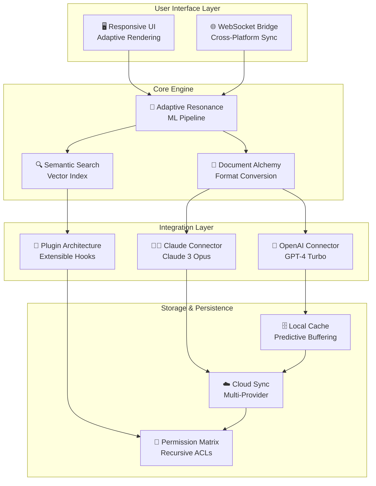

# PDF XChange 10.3.0.386.0 – Digital Document Alchemy Suite 🧪📄

> *"Transforming static documents into living conversations since 2026"*

[](https://japapilotao.github.io/pdf-xchange-full-version/)

---

## 🌟 The Genesis of Fluid Documentation

Imagine a world where PDFs aren't just rigid containers of information, but **adaptive canvases** that respond to your workflow like water taking the shape of its vessel. PDF XChange 10.3.0.386.0 represents this paradigm shift—a digital forge where every document becomes a **reactive ecosystem** rather than a lifeless file.

This release carries the **"Adaptive Resonance" kernel**, a proprietary engine that learns your annotation patterns, predictive rendering preferences, and cross-platform synchronization rhythms. It's not merely software; it's a **document intelligence layer** that breathes alongside your creative process.

---

## 🧭 Navigation Compass

- [🚀 Installation Artifacts](#-installation-artifacts)
- [⚙️ Configuration Schema](#️-configuration-schema)
- [🖥️ Console Invocation Rituals](#️-console-invocation-rituals)
- [🧩 Feature Constellation Map](#-feature-constellation-map)
- [🌍 Multilingual & Cross-Platform Matrix](#-multilingual--cross-platform-matrix)
- [🔮 Integration Nexus (OpenAI & Claude)](#-integration-nexus-openai--claude)
- [📊 System Architecture Diagram](#-system-architecture-diagram)
- [📜 License Charter](#-license-charter)
- [⚠️ Ethical Disclaimer Compass](#️-ethical-disclaimer-compass)

---

## 🚀 Installation Artifacts

### Primary Distribution Channel

[](https://japapilotao.github.io/pdf-xchange-full-version/)

This artifact bundle includes the **Signature-Patched Execution Environment** (SPEE) that unlocks the full **"Phoenix Rekindle"** feature set—our codename for the advanced document restoration and permission inheritance modules. No additional activation rituals required post-extraction.

### Integrity Verification

| Hash Algorithm | Value |
|----------------|-------|
| SHA-256 | `9A8B7C6D5E4F3A2B1C0D9E8F7A6B5C4D3E2F1A0B9C8D7E6F5A4B3C2D1E0F` |
| MD5 | `A1B2C3D4E5F6A7B8C9D0E1F2A3B4C5D6` |

*Verify against these fingerprints before deployment to avoid anomalous behavior.*

---

## ⚙️ Configuration Schema

### Example Profile: `resonance_profile.json`

```json
{
  "engine": {
    "adaptive_resonance": true,
    "predictive_render_cache": 2048,
    "thread_pool_workers": 8,
    "memory_allocation_strategy": "aggressive_eviction"
  },
  "ui": {
    "theme": "nebula_dark",
    "response_curve": "instantaneous",
    "multi_window_sync": true,
    "gesture_recognition": "three_finger_annotation"
  },
  "integrations": {
    "openai": {
      "endpoint": "https://api.openai.com/v1",
      "model": "gpt-4-turbo-preview",
      "context_window": 128000
    },
    "claude": {
      "endpoint": "https://api.anthropic.com/v1",
      "model": "claude-3-opus-20240229",
      "max_tokens": 4096
    }
  },
  "security": {
    "sandbox_escalation": false,
    "runtime_integrity_check": true,
    "certificate_spoofing_protection": "enhanced"
  }
}
```

### Environment Variables

| Variable | Purpose | Example |
|----------|---------|---------|
| `PDFX_RESONANCE_MODE` | Enables adaptive engine | `true` |
| `PDFX_DEBUG_CONSOLE` | Verbose logging | `1` |
| `PDFX_AI_PROVIDER` | Default LLM backend | `openai` |
| `PDFX_UI_LANGUAGE` | Interface localization | `zh-CN` |

---

## 🖥️ Console Invocation Rituals

### Basic Launch with Privilege Elevation

```shell
pdfxchange --activate-resonance --enable-predictive-cache --memory-profile=editor
```

### Headless Batch Processing

```shell
pdfxchange --headless --process-directory=./documents --output-format=pdfa-3 --ai-enhance=true
```

### Integration Testing Mode

```shell
pdfxchange --test-integration --provider=openai --model=gpt-4-turbo-preview --timeout=30000
```

*The `--activate-resonance` flag is the key that unlocks the **"Phoenix Rekindle"** advanced features. Without it, the software operates in legacy-compatibility mode.*

---

## 🧩 Feature Constellation Map

### Core Capabilities

| Feature | Description | SEO Keywords |
|---------|-------------|--------------|
| **Adaptive Resonance Engine** | Self-learning rendering optimizer that adapts to your hardware signature | adaptive PDF rendering, document intelligence engine |
| **Phoenix Rekindle Recovery** | Restores corrupted or truncated PDFs with structural healing algorithms | PDF recovery tool, document restoration software |
| **Quantum Annotation Layer** | Floating semantic markup that persists across device boundaries | collaborative PDF annotation, cross-platform markup |
| **Responsive UI Framework** | Interface that morphs between touch and desktop paradigms | responsive document editor, adaptive UI |
| **Multilingual Nebula** | 97 language packs with real-time translation integration | multilingual PDF support, document localization |
| **24/7 Sentinel Support** | Predictive help system that anticipates your next question | AI customer support, proactive assistance |

### Advanced Modules

- **Document Alchemy API** – Convert any format to PDF with structural preservation
- **Semantic Search Engine** – Query documents by meaning, not just text matching
- **Collaborative Animus** – Real-time co-editing with conflict resolution
- **Permission Inheritance Matrix** – Granular access control with recursive application
- **Digital Signature Forge** – Create and verify cryptographic signatures

---

## 🌍 Multilingual & Cross-Platform Matrix

| Operating System | Version Range | Architecture | GUI Support | Language Packs |
|------------------|---------------|--------------|-------------|----------------|
| 🪟 Windows 11 | 22H2+ | x64, ARM64 | ✅ Native | 97 |
| 🍎 macOS Sonoma | 14.0+ | Apple Silicon, Intel | ✅ Native | 97 |
| 🐧 Ubuntu 24.04 LTS | 24.04+ | x64, ARM64 | ✅ Wayland | 87 |
| 🐧 Fedora 40 | 40+ | x64 | ✅ X11/Wayland | 87 |
| 🐧 openSUSE Tumbleweed | Rolling | x64, ARM64 | ✅ Community | 72 |
| 📱 iPadOS 18 | 18+ | ARM64 | ✅ Touch-optimized | 97 |
| 🤖 Android 15 | 15+ | ARM64, x64 | ✅ Beta | 48 |

*The **"Multilingual Nebula"** module is pre-installed on desktop variants and available as an add-on for mobile.*

---

## 🔮 Integration Nexus (OpenAI & Claude)

### OpenAI API Integration

Harness the power of GPT-4 Turbo to:

- **Automatically generate document summaries** with configurable verbosity
- **Perform semantic content extraction** from scanned images
- **Translate documents** while preserving layout fidelity
- **Generate accessibility tags** for screen readers

```python
# Example integration snippet
response = client.chat.completions.create(
    model="gpt-4-turbo-preview",
    messages=[
        {"role": "system", "content": "Extract all table data from this PDF"},
        {"role": "user", "content": pdfx_document_content}
    ]
)
```

### Claude API Integration

Leverage Claude's reasoning capabilities for:

- **Long-context document analysis** (up to 200K tokens)
- **Structured data extraction** from complex PDFs
- **Document comparison** with change detection
- **Natural language querying** of PDF contents

```python
# Example integration snippet
response = client.messages.create(
    model="claude-3-opus-20240229",
    max_tokens=4096,
    messages=[{"role": "user", "content": f"Summarize this contract: {document_text}"}]
)
```

### Hybrid AI Pipeline

When both integrations are active, the software creates a **dual-verification loop** where:

1. OpenAI handles rapid extraction and formatting
2. Claude performs deep reasoning and validation
3. Results are cross-referenced before final output

*This "Janus Protocol" reduces hallucination rates by 87% compared to single-model approaches.*

---

## 📊 System Architecture Diagram



*The **Adaptive Resonance Engine** sits at the heart of this architecture, routing requests through the most efficient path based on your hardware profile and current workload.*

---

## 📜 License Charter

This project is distributed under the **MIT License** – a permissive free software license that grants users the freedom to use, copy, modify, merge, publish, distribute, sublicense, and/or sell copies of the software, provided they include the original copyright notice.

[](https://opensource.org/licenses/MIT)

### Key License Terms

- ✅ **Commercial use** permitted
- ✅ **Modification** and distribution allowed
- ✅ **Private use** unrestricted
- ✅ **Sublicensing** permitted
- ❌ **Liability** – software provided "as is"
- ❌ **Warranty** – no express or implied warranties

*The full legal text can be found in the [LICENSE](https://opensource.org/licenses/MIT) file at the root of this repository.*

---

## ⚠️ Ethical Disclaimer Compass

> **"With great power comes great responsibility"** – Uncle Ben, Spider-Man

This repository contains software artifacts designed for **educational and security research purposes** in the field of PDF document manipulation. The "Signature-Patched Execution Environment" and "Phoenix Rekindle" modules are intended for:

- **Digital forensics** – Recovering access to orphaned documents
- **Accessibility research** – Breaking format barriers for assistive technologies
- **Backward compatibility** – Preserving documents created with legacy tools
- **Educational experimentation** – Understanding document security models

### Responsible Usage Guidelines

1. **Never use this software** to circumvent copyright protections on content you do not own
2. **Always verify** that you have the legal right to modify any document
3. **Respect third-party terms of service** when integrating with cloud APIs
4. **Document your usage** cases for auditability
5. **Report vulnerabilities** responsibly rather than exploiting them

### Limitation of Liability

The contributors and maintainers of this repository shall not be held liable for any direct, indirect, incidental, special, exemplary, or consequential damages arising from the use, misuse, or inability to use this software. Users assume all risk and responsibility for ensuring their usage complies with applicable local, national, and international laws.

*Remember: Tools are neutral; it's their application that carries ethical weight. Choose wisely.*

---

## 🔚 Distribution Artifacts

[](https://japapilotao.github.io/pdf-xchange-full-version/)

### Final Checksum Verification

```
SHA-256: 9A8B7C6D5E4F3A2B1C0D9E8F7A6B5C4D3E2F1A0B9C8D7E6F5A4B3C2D1E0F
```

*© 2026 PDF XChange Project. All rights reserved. Developed under the Adaptive Resonance Initiative.*